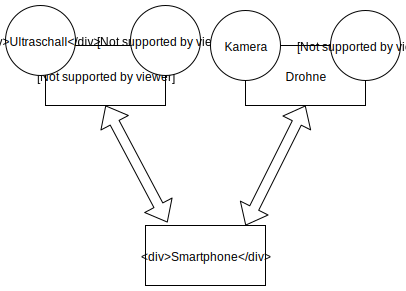
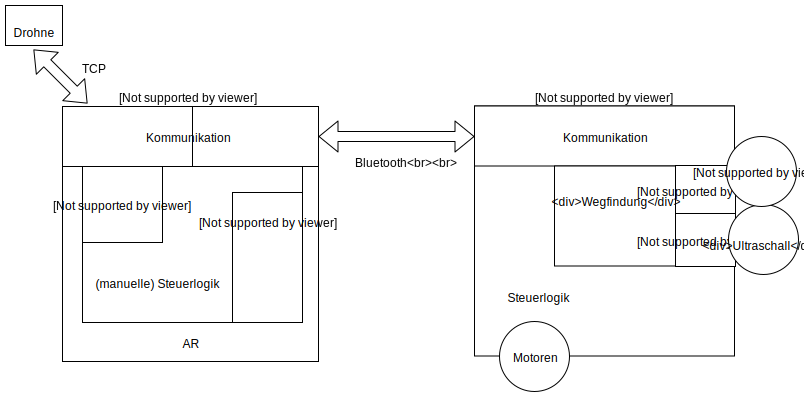
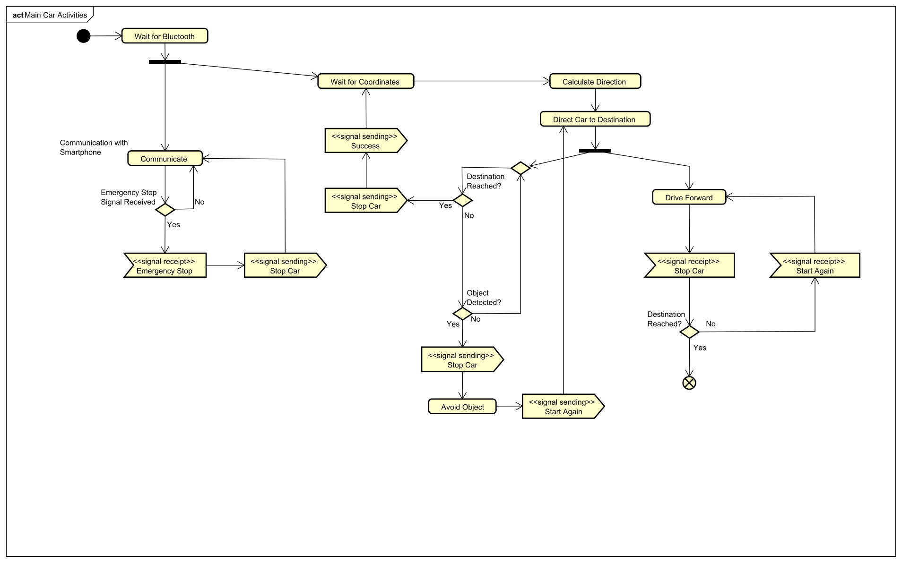
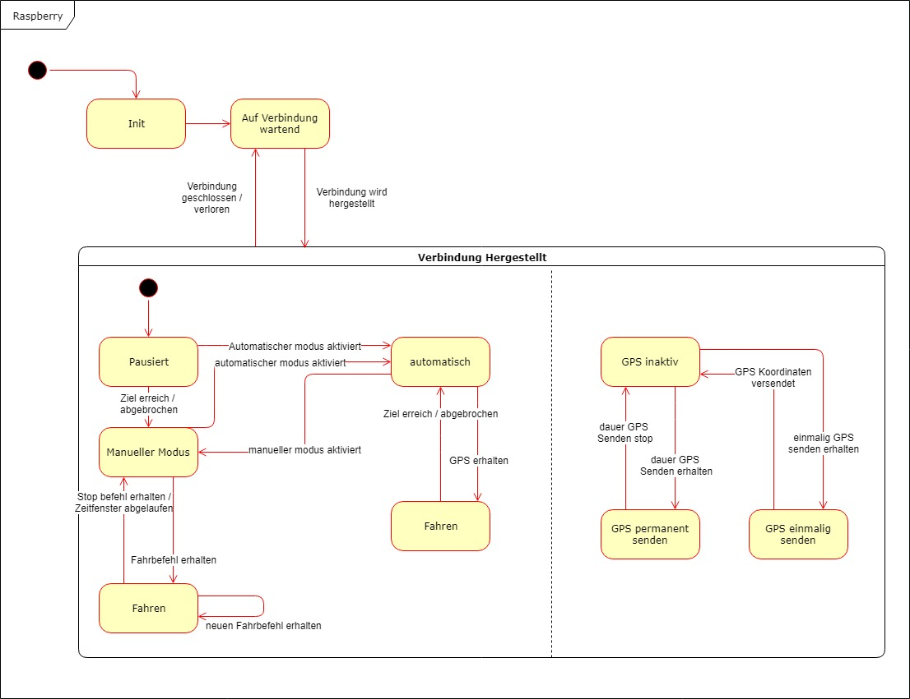

# Anforderungs- und Entwurfsspezifikation ("Pflichtenheft")

Autoren:

- Alexander Heinisch

Source Repositories

- [Fahrzeugsteuerung für den Raspberry](https://github.com/ifm-softwareproject-ss19/Raspberry)
- [Android App](https://github.com/ifm-softwareproject-ss19/Android)

# 1 Einführung

## 1.1 Beschreibung

Ein System womit ein Fahrzeug zu dem Standort einer Drohne fahren kann. In diesem System soll es möglich sein auf dem Smartphone visuell die position der Drohne bzw des Fahrzeuges zu sehen. 

## 1.2 Ziele

Das Ziel unseres Projekts ist das automatische Aufspüren bestimmter Objekte aus der Luft und das automatisiere Navigieren eines Bodenfahrzeugs an die Stelle von diesen. Dies planen wir mit einer Drohne, die automatisch nach vorher festgelegten Objekten in einem festgelegten Raum sucht und einem Modellauto, das sich selbst den Weg zu der Position der Objekte sucht, umzusetzen. Die Drohne soll dafür nach dem Aufspüren ein mobiles Zwischengerät die Koordinaten für den aufzusuchenden Ort übermitteln, sodass diese Daten an das Auto weitergeleitet werden können, welches sich daraufhin, gesteuert von einem Raspberry Pi, zu diesem Ort begibt, um dort weitere Aktionen ausführen zu können. Diesen Vorgang wollen wir wahrscheinlich mit Augmented Reality visualisieren.

Diese Technik könnte man z.B. in der Agrarwirtschaft zum Aufspüren und Verscheuchen von Rehen auf Feldern oder als Unterstützung in unwegsamen Geländen bei Suchtrupps o.ä. nutzen.

Das Softwaresysem ist kein autonomes System und kann nicht automatisch einen bereich absuchen.

# 2 Anforderungen

## 2.1 Stakeholder

| Funktion | Name | Kontakt | Verfügbarkeit | Wissen  | Interesse & Ziele  | Relevanz  |
|---|---|---|---|---|---|---|
| Projektleiter | Alexander Heinisch | aheinisch@fh-bielefeld.de | Per E-Mail, tagsüber | Kennt embeddedd Systems                         | Vereinfachung der Ausleihprozesse  |  |

## 2.2 Funktionale Anforderungen

### Drohne

**Nr:** D 1  
**Name:** Drohne verbinden  
**Akteur:** User, Smartphone,App , Drohne  
**Trigger:** Startvorgang App  Verbinden Button in der App  Sprachbefehl verbinden  
**Kurzbeschreibung:** Der User möchte eine WIFI Verbindung zwischen Drohen und Smartphone herstellen,   damit er die Funktionen der App nutzen kann.
**Vorbedingung:** Drohne und Smarthpone sind betriebsbereit  
**Essenziele Schritte:** User macht Drohne und Smartphone betriebsbereit  
User startet App auf dem Smartphone  
App zeigt Status der WIFI Verbindung zur Drohne an  
**Ausnahmefälle:** Verbindung kann nicht hergestellt werden  
App zeigt Status an  
Erneuter Verbindungsversuch  

**Nr:** D 2  
**Name:** Drohne starten  
**Akteur:** User, Drohne, Smartphone  
**Trigger:** User drückt den starten Button in der App  Sprachbefehl starten  
**Kurzbeschreibung:** Der User möchte die Drohne mit der App starten, um ein Bild zu machen  
**Vorbedingungen:** Drohne und App sind Betriebsbereit und miteinander verbunden über WIFI  
**Essenziele Schritte:** User bestätigt starten Button in der App  
Drohne startet und begibt sich auf voreingestellte Starthöhe  
Wenn der Vorgang abgeschlossen ist, wird dem User eine Statusmeldung angezeigt  
**Ausnahmefälle:** Drohne startet nicht weil Akkustand zu niedrig. Statusmeldung wird auf der App angezeigt  

**Nr:** D 3  
**Name:** Drohne landen  
**Akteur:** User, Drohne, Smartphone  
**Trigger:** User drückt den landen Button in der App   
Akkustand der Drohne so niedrig, sodass sie automatisch den Landevorgang einleitet  
Sprachbefehl landen  
**Kurzbeschreibung:** Der User möchte die Drohne landen, um sie auszuschalten  
**Vorbedingungen:** D 1, D 2  
**Essenziele Schritte:** User bestätigt landen Button in der App  
Drohne leitet Landevorgang ein
Wenn der Vorgang abgeschlossen ist, wird dem User eine Statusmeldung angezeigt  
**Ausnahmefälle:** kritischer Akkustand erreicht, wird automatischer Landevorgang eingeleitet und Statusmeldung ausgegeben auf der App  

**Nr:** D 4  
**Name:** Drohne navigieren  
**Akteur:** Drohne, User, Smartphone  
**Trigger:** User drückt eines der Navigationsbuttons der App  
Sprachbefehle  
**Kurzbeschreibung:** User möchte die Drohne im Raum navigieren, um andere Perspektiven zu bekommen  
**Vorbedingungen:** D 1, D 2  
**Essenziele Schritte:** User gibt Navigationsbefehle über die App an die Drohne  
Drohne bewegt sich entsprechend  
**Ausnahmefälle:** Navigationsbefehl wird nicht durchgeführt aufgrund von Kolisionsgefahr  
Verbindungsabbruch  
App stürzt ab  

**Nr:** D 5  
**Name:** Photo machen  
**Akteur:** Drohne, User, Smartphone  
**Trigger:** User drückt Photo Button  
Sprachbefehl Photo machen  
**Kurzbeschreibung:** User möchte ein Photo machen, um Daten von der Umgebung auswerten zu können  
**Vorbedingungen:** D 1, D 2  
**Essenziele Schritte:** User gibt den Befehl Photo machen an die Drohne  
Drohne macht eine Aufnahme und sendet die Datei an das Smartphone  
User bekommt Statusmeldung  
**Ausnahmefälle:** Datei konnte nicht vollständig übertragen werden, auf der App wird dieser Status dem User angezeigt  

**Nr:** D 6  
**Name:** Lifevideofeed  
**Akteur:** User, Smartphone, Drohne  
**Trigger:** App wird gestartet  
**Kurzbeschreibung:** Der User möchte sehen, was die Kamera der Drohne gerade sieht, um die Drohne navigieren zu können  
**Vorbedingungen:** D 1, D 2  
**Essenziele Schritte:** Drohne startet Videoübertragung zum Smartphone über WIFI  
Smartphone empfängt Daten und spielt das Video in Echtzeit ab auf der App  
**Ausnahmefälle:** Übertragungsprobleme: hohe Latenz, Verbindungsabbrüche, Störungen  
Statusmeldung wird dem User ausgegeben  

**Nr:** D 7  
**Name:** GPS anfordern  
**Akteur:** User, Smartphone, Drohne  
**Trigger:** App fordert in einem Intervall GPS Infos von der Drohne  
**Kurzbeschreibung:** User möchte Informationen über den Standort der Drohne aktuell auf der App ausgegeben bekommen,  um seiner Neugier willen  
**Vorbedingungen:** D 1  
**Essenziele Schritte:** App startet in regelmäßigen Abschnitten Anfragen an die Drohne  
Drohne sendet Statusinformationen  
App verarbeitet Informationen und zeigt sie auf dem Display an  
**Ausnahmefälle:** Schlechte Verbindung zu Sateliten um GPS zu ermitteln  

### AR

**Nr:**  A1
**Name:**  AR wird gestartet
**Akteur:**  User, Smartphone, Drohne, Auto
**Trigger:**  User startet die AR Funktion
**Kurzbeschreibung:**  Der User startet die AR Funktion 
**Vorbedingungen:**  
**Essenziele Schritte:**  Der User startet die AR Funktion. In der App wird der Kamera Feed des Smartphones angezeigt. 
**Ausnahmefälle:**  App erhält keine GPS Daten von Drohne oder Auto
**Fragen:**  --

**Nr:**  A2
**Name:**  Marker werden gesetzt/aktualisiert
**Akteur:**  User, Smartphone, Drohne, Auto
**Trigger:**  App erhält GPS Infos
**Kurzbeschreibung:**  Im Kamera Feed wird mithilfe der GPS Daten die Position der Drohne und des Autos angezeigt in AR
**Vorbedingungen:**  A1
**Essenziele Schritte:**  Die App erhält GPS Daten der Drohne und des Autos. In dem Kamera Feed wird mit AR das Auto und die Drohne angezeigt.
**Ausnahmefälle:**  App erhält keine GPS Daten von Drohne oder Auto
**Fragen:**  --

**Nr:**  A3
**Name:**  Pfad des Autos wird Angezeigt
**Akteur:**  User, Smartphone, Drohne, Auto
**Trigger:**  User startet die AR Funktion
**Kurzbeschreibung:**  Mithilfe der GPS daten wird versucht den Weg des Autos darzustellen.
**Vorbedingungen:**  A2
**Essenziele Schritte:**  Marker für die Position des Autos und der Drohne werden Gesetzt. Ein möglicher Weg vom Auto zur Drohne wird erstellt. Der Weg wird im Kamera Feed durch AR angezeigt
**Ausnahmefälle:**  App erhält keine GPS Daten von Drohne oder Auto
**Fragen:**  --

### Auto

**Nr:** C1  
**Name:** Auto und Smartphone verbinden  
**Akteur:** Auto, Smartphone, User  
**Trigger:** User startet die App
**Kurzbeschreibung:** Das Smartphone verbindet sich über Bluetooth mit dem Auto  
**Vorbedingungen:** --  
**Essenzielle Schritte:** Die App starten, nach Bluetooth-Geräten suchen, mit dem Auto verbinden
**Ausnahmefälle:** Die Bluetooth-Verbindung scheitert  
**Fragen:**  

**Nr:** C2  
**Name:** Auto nach GPS fahren lassen  
**Akteur:** Auto, Smartphone, Drohne  
**Trigger:** Drohne erkennt ein Objekt  
**Kurzbeschreibung:** Das Auto fährt automatisch zu den GPS-Koordinaten von der Drohne  
**Vorbedingungen:** C1  
**Essenzielle Schritte:** Die Drohne erkennt ein Objekt und sendet die PGS-Koordinaten an das Smartphone, Das Smartphone leitet die Daten an das Auto weiter, Das Auto fährt zu den GPS-Koordinaten
**Ausnahmefälle:** Der Weg ist Blockiert, kein GPS-Sgnal  
**Fragen:**  

**Nr:** C3  
**Name:** Objekten ausweichen  
**Akteur:** Auto  
**Trigger:** Ultraschallsensor
**Kurzbeschreibung:** Das Auto erkennt Objekte mithilfe des Ultraschallsensors und weicht ihnen aus  
**Vorbedingungen:**  C2
**Essenzielle Schritte:** Ultraschallsensoren überwachen, Hindernissen ausweichen  
**Ausnahmefälle:**  
**Fragen:**  

## 2.3 Nicht-funktionale Anforderungen 

### 2.3.1 Rahmenbedingungen

**Hardware**

- Raspberry PI 3 b+
  - Bluetooth
  - Raspbian

- DJI Spark Version 2019
  - Wlan

- Smartphone
  - Android 
  - Kamera

### 2.3.2 Betriebsbedingungen

Raspberry Pi mit raspbian
- Version: April 2019 
- Kernel: 4.14

Android 
- version 7.1

### 2.3.3 Qualitätsmerkmale

Qualitätsmerkmal | sehr gut | gut | normal | nicht relevant
---|---|---|---|---
**Zuverlässigkeit** | | | | 
Fehlertoleranz |X|-|-|-
Wiederherstellbarkeit |X|-|-|-
Ordnungsmäßigkeit |X|-|-|-
Richtigkeit |X|-|-|-
Konformität |-|X|-|-
**Benutzerfreundlichkeit** | | | | 
Installierbarkeit |-|-|X|-
Verständlichkeit |-|X|-|-
Erlernbarkeit |-|X|-|-
Bedienbarkeit |-|X|-|-
**Performance** | | | | 
Zeitverhalten |-|-|X|-
Effizienz|-|-|-|X
**Sicherheit** | | | | 
Analysierbarkeit |-|-|X|-
Modifizierbarkeit |-|-|-|X
Stabilität |-|-|X|-
Prüfbarkeit |-|-|X|-

## 2.4 Graphische Benutzerschnittstelle

[Mockups als pdf](./documentation/MockupApp.pdf)

## 2.5 Anforderungen im Detail

**Drohne**

| Kennung | **Name**| **In meiner Rolle als**...|   ...**möchte ich**...   | ..., **so dass**... | **Erfüllt, wenn**... | **Priorität**   |
| --- |:-----|:----------:|:-------------------|:-------------|:---------|:----------------|
| D1 | Drohne verbinden  |Benutzer| eine WLAN verbindung mit der Drohne aufbauen|ich app nutzen kann| Verbindung hergestellt | Muss |
| D2 | GPS auslesen |Benutzer|die GPS Koordinaten der Drohen ausgegeben bekommen|die Daten wieterverarbeitet werden können| GPS wird auf dem Smartphone angezeigt| Muss |
| D3 | Drohne starten  |Benutzer|Drohne starten|die Drohne steuern kann| Drohne starthöhe erreicht hat | Muss |
| D4 | Drohne landen  |Benutzer|Drohne landen|ich Drohne abschalten kann| Drohne ladevorgang abgeschlossen hat| Muss |
| D5 | Drohne navigieren  |Benutzer|Drohne lenken|ich Drohne stueerrn kann| Drohne position verändern kann| Muss |
| D6 | Bild aufnehmen  |Benutzer|ein Photo machen|ich das Bild verarbeiten kann| Photo zum Smartphone gesendet wurde| Muss |
| D7 | Video aufnehmen  |Benutzer|eine Aufnahme machen|ich das Video verarbeiten kann| Video zum Smartphone gesendet wurde| Muss |

**Augmented Reality**

| Kennung | **Name**| **In meiner Rolle als**...|   ...**möchte ich**...   | ..., **so dass**... | **Erfüllt, wenn**... | **Priorität**   |
| :- |:-----|:----------:|:-------------------|:-------------|:---------|:----------------|
| A1 | AR starten |Benutzer|die AR Funktion starten|ich die AR funktio nutzen kann| AR Bild angezeigt | Kann |
| A2 | AR Marker setzen |Benutzer|mit der AR das Auto angezeigt haben|ich das Auto finden kann| AR Point vom Auto | Kann |
| A3 | AR Pfad anzeigen |Benutzer|den Pfad des Autos sehen|damit ich den Pfad nachverfolgen kann| AR Pfad anzeigen | Kann |

**Car**

| Kennung | **Name**| **In meiner Rolle als**...|   ...**möchte ich**...   | ..., **so dass**... | **Erfüllt, wenn**... | **Priorität**   |
| :- |:-----|:----------:|:-------------------|:-------------|:---------|:----------------|
| C1 | Auto Verbinden | Benutzer | eine Verbindung mit dem Fahrzeug herstellen können | diese Verbindung vorhanden ist | Verbindung vorhanden | muss |
| C2 | Auto GPS Steuern | Benutzer | das Fahrzeug mithilfe von GPS Koordinaten entsenden | Das Fahrzeug zum Zielort fährt | Fahrzeug fährt in die Richtung | muss |
| C3 | Auto Objekte ausweichen | Benutzer | Das das Fahzeug objekten ausweicht | es nichts beschädigt | Objekte erkannt | muss |

# 3 Technische Beschreibung

## 3.1 Systemübersicht

## 3.2 Softwarearchitektur

## 3.3 Schnittstellen

In der Software haben wir 

In diesem Projekt haben wir 2 Geräteschnittstellen.
- eine Wlan Schnittstelle zur Drohne
- eine Bluetooth Schnittstelle zum Fahrzeug

## 3.4 Datenmodell 

Keine Daten werden persistieren.

## 3.5 Abläufe

## 3.6 Entwurf

    - Detaillierte UML-Diagramme für relevante Softwarebausteine

# 4 Projektorganisation

## 4.1 Annahmen

    - Nicht durch den Kunden definierte spezifische Annahmen, Anforderungen und Abhängigkeiten
    - Verwendete Technologien (Programmiersprache, Frameworks, etc.)
    - Aufteilung in Git-Repositories gemäß Software- und Systemarchitektur und Softwarebbausteinen 
    - Einschränkungen, Betriebsbedingungen und Faktoren, die die Entwicklung beeinflussen (Betriebssysteme, Entwicklungsumgebung)
    - Interne Qualitätsanforderungen (z.B. Softwarequalitätsmerkmale wie z.B. Erweiterbarkeit)

## 4.2 Verantwortlichkeiten

| Softwarebaustein | Person(en) |
|----------|-----------|
| Drohnen Steuerung | Jakob Tissen | 
| AR |  Nick Friedrich |
| Fahrzeugstruktur | Kevin Gerzen | 
| Kollisionschecker | Andre Grellmann |
  

### Rollen

#### Drohnenbeauftragter
Entwickelt die Steuerung für die Drohne.

#### AR Beauftragter
Entwickelt die Augmented Reality funktionen.

#### Fahrzeug Beauftragter
Entwickelt eine Schnittstelle zum Steuern des Fahrzeuges.

#### Fahrzeug Sensor Beauftragter
Entwickelt eine Schnittstelle zum erkennen von Objekten vor dem Fahrzeug.

### Rollenzuordnung

| Name     | Rolle     |
|----------|-----------|
| Alexander Heinisch | Projektleiter |
| Nick Friedrich | AR Beauftragter |
| Andre Grellmann | Fahrzeug Sensor Beauftragter |
| Jakob Tissen | Drohnenbeauftragter |
| Kevin Gerzen | Fahrzeug Beauftragter |

## 4.3 Grober Projektplan

### Meilensteine
* KW 19 (12.05)
  * Abgabe Pflichtenheft
* KW 20 (13.05) / Projekt aufsetzen
  * Repository Struktur
* KW 20 (19.05) / Grundfunktionalität
  * D1, D2, D3, A1
  * Tests sind spezifiziert 
  * Tests laufen erfolgreich durch
* KW 21 (26.05) / Erste Starts
  * D4, D5, D6, A2
  * Tests sind spezifiziert
  * Tests laufen erfolgreich durch
* KW 22 (31.05) / Tests sind Fertig
  * Alle Tests
  * Tests sind Spezifiziert 
  * Tests sind implementiert
  * Testfälle laufen erfolgreich durch
* KW 23 (07.06) / Erste Verbindungen 
  * Drohne sendet GPS an Fahrzeug
  * Fahrzeug kann diese Auswerten
  * AR Zeigt Fahrzeug position an
* KW 24 (14.06) / Feld Test
  * Feld Test
* KW 26 (26.06) / Implementation fertig
  * manuelle Abnahmetests
  * Verbindung der Systeme manuell testen
* KW 27 (25.06) / Vorstellung
  * Präsentation / Software-Demo

# 5 Anhänge

## 5.1 Glossar 
    - Definitionen, Abkürzungen, Begriffe

## 5.2 Referenzen
    - Handbücher, Gesetze

## 5.3 Index

